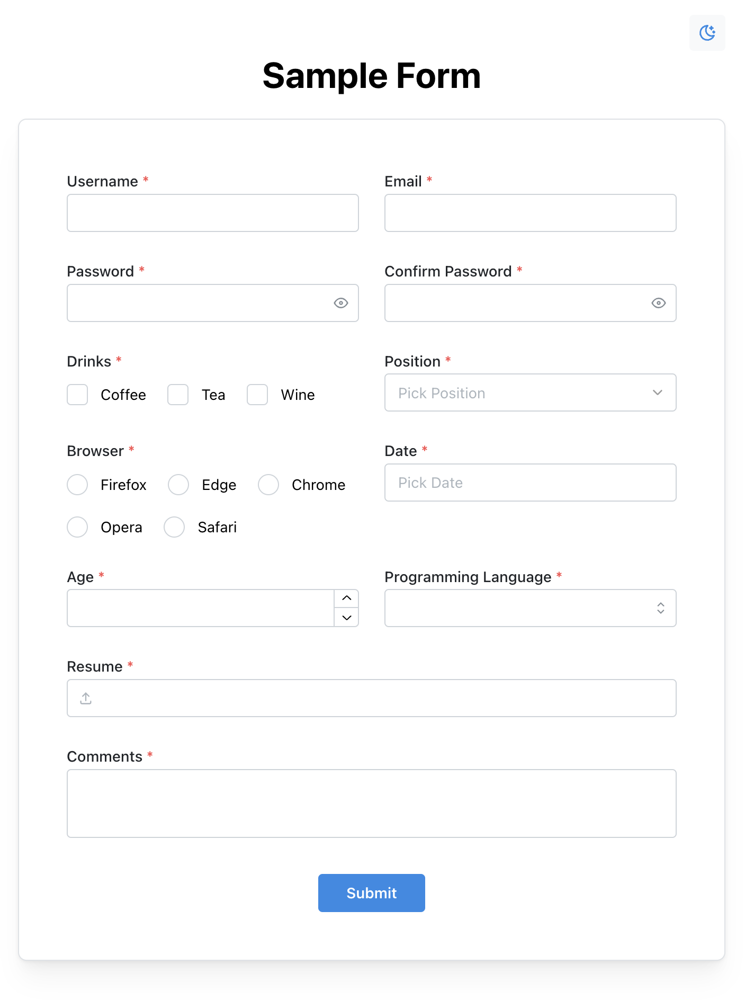

# Mantine-styled RHF (React Hook Form) Controlled Components in Typescript and NextJS

This [mantine-next-template](https://github.com/mantinedev/mantine-next-template) integrates [React Hook Form](https://github.com/react-hook-form/react-hook-form) as a means of form contol and [Zod](https://github.com/colinhacks/zod) as form validation. Input components developed by Mantine can be easily controlled through `<FormController />` as in [here](https://github.com/Rayologist/rhf-zod-mantine-typescript-template/blob/main/src/containers/Form.tsx).



## The `useForm` Hook

A custom hook `useForm` is implemented as a wrapper of RHF to solve the problem of boilerplate codes as shown in [`src/containers/Form.tsx`](https://github.com/Rayologist/rhf-zod-mantine-typescript-template/blob/main/src/containers/Form.tsx#L216-L242) when developers are constructing forms. The sample form  is adapted from [Mantine UI](https://ui.mantine.dev/category/authentication#authentication-title), and can be found in [`src/pages/simple-form.tsx`](https://github.com/Rayologist/rhf-zod-mantine-typescript-template/blob/main/src/pages/simple-form.tsx#L11-L43).

### Usage

Please refer directly to the codes [here](https://github.com/Rayologist/rhf-zod-mantine-typescript-template/blob/main/src/pages/simple-form.tsx).

The props are almost the same as `useForm` in [`React Hook Form`](https://react-hook-form.com/api/useform). However, there are three fields required:

1. defaultvalues: Same as RHF but required
2. onSubmit: Same as RHF `SubmitHandler` in [`handleSubmit`](https://react-hook-form.com/api/useform/handlesubmit)
3. controllers: Objects of field props. Required props: control (controlled components), label (Field label), name (HTML input name)

And two optional fields:

1. schema: Zod schema.
2. onSubmitError: Same as RHF `SubmitErrorHandler` in [`handleSubmit`](https://react-hook-form.com/api/useform/handlesubmit)

In addition, there are two ways to access `RHF useForm returned methods`:

   1. Using array destructured value, as exemplified [here](https://github.com/Rayologist/rhf-zod-mantine-typescript-template/blob/main/src/pages/simple-form.tsx#L11).
   2. Using `render props` as shown in [here](https://github.com/Rayologist/rhf-zod-mantine-typescript-template/blob/main/src/pages/simple-form.tsx#L73-L87).

Moreover, submit button for the form can be accessed using dot notation [[example](https://github.com/Rayologist/rhf-zod-mantine-typescript-template/blob/main/src/pages/simple-form.tsx#L84-L86)]. The only difference between this one and that of mantine is that `id` and `loaderProps` are already passed to the button props, as shown in [here](https://github.com/Rayologist/rhf-zod-mantine-typescript-template/blob/main/src/pages/simple-form.tsx#L73-L75), so that the button does not have to live inside html form tag, such as [this one](https://github.com/Rayologist/rhf-zod-mantine-typescript-template/blob/main/src/pages/simple-form.tsx#L107-L109).

## Current List of Controlled Components from Mantine

- [x] [Checkbox Group](https://mantine.dev/core/checkbox/)
- [x] [File Input](https://mantine.dev/core/file-input/)
- [x] [Multi-Select](https://mantine.dev/core/multi-select/)
- [x] [Number Input](https://mantine.dev/core/number-input/)
- [x] [Password Input](https://mantine.dev/core/password-input/)
- [x] [Radio Group](https://mantine.dev/core/radio/)
- [x] [Select](https://mantine.dev/core/select/)
- [x] [Text Area](https://mantine.dev/core/textarea/)
- [x] [Text Input](https://mantine.dev/core/text-input/)
- [x] [Date Picker](https://mantine.dev/dates/date-picker/)
- [x] [Switch Group](https://mantine.dev/core/switch/)

## Getting Started

First, run the development server:

```bash
pnpm dev
# or
npm run dev
# or
yarn dev
```

Open [http://localhost:3000](http://localhost:3000) with your browser to see the result.

## Contact

If you have any questions, please feel free to file issues or contact me at **rayologist1002@gmail.com**
